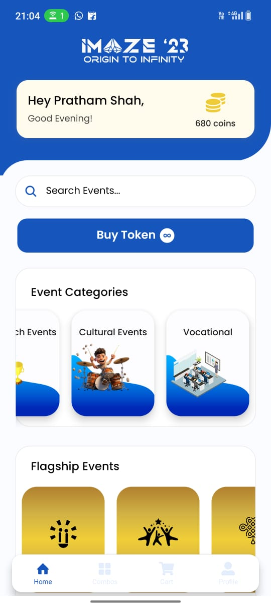
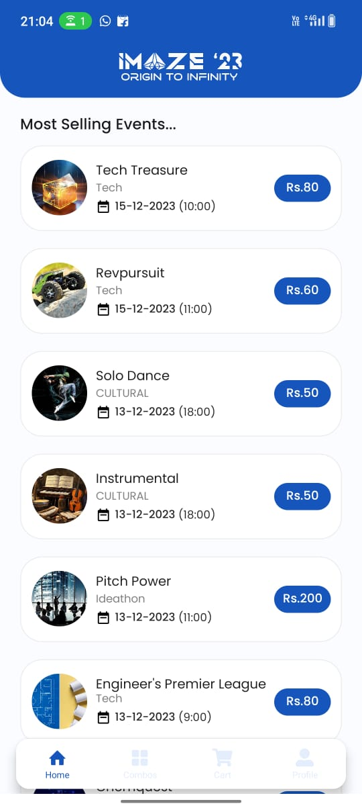
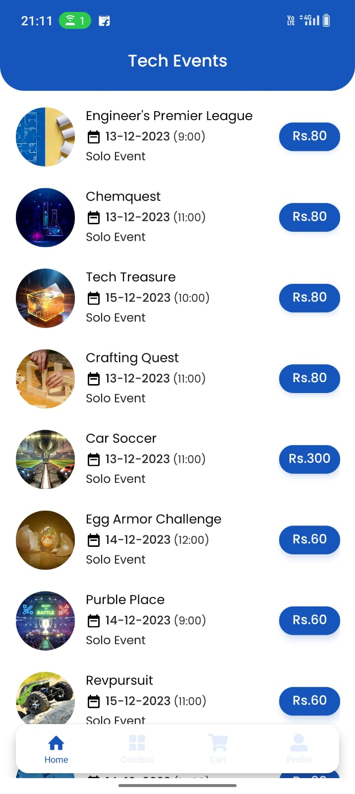
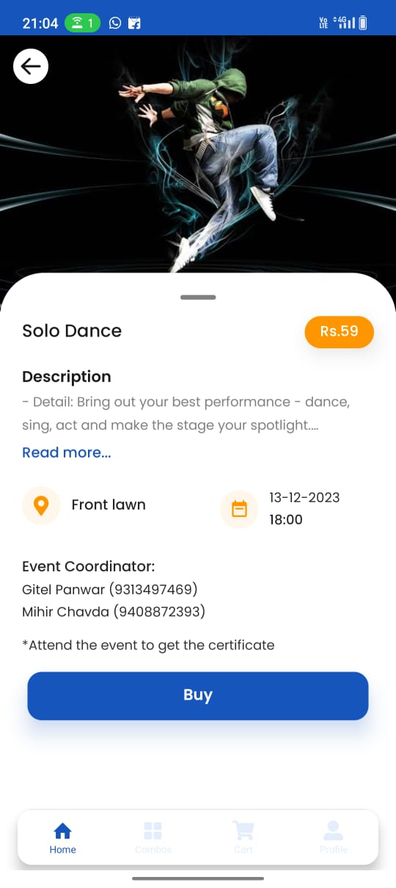
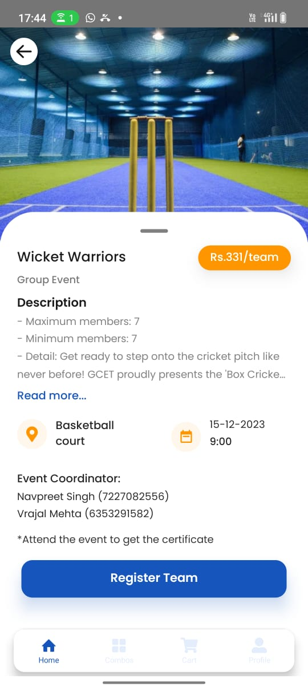
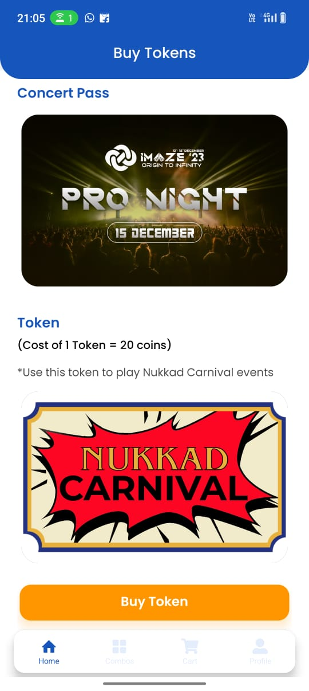
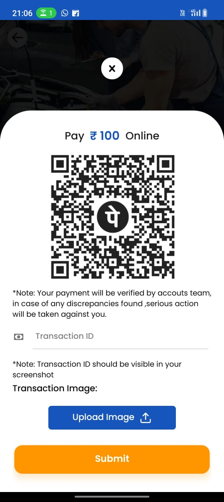
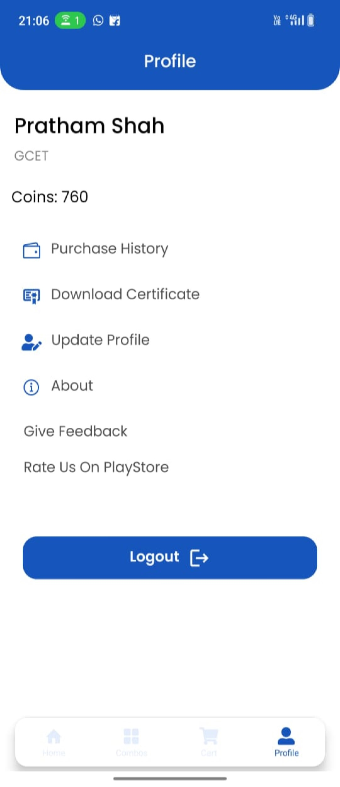
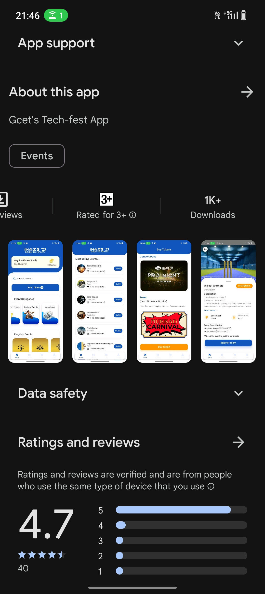

# 🎉 IMAZE '23 — Tech Fest User App

A React Native mobile application developed for **IMAZE '23**, the annual technical and cultural festival of **G. H. Patel College of Engineering & Technology (GCET)**.

The application provides students with a centralized platform to discover events, explore event categories, register for individual and group events, purchase tokens, complete payments, manage their participation, and access certificates.

> 📱 **1,500+ Downloads**  
> ⭐ **4.7★ Google Play Store Rating**

---

## 📱 Application Preview


The application was designed to provide a complete digital experience for participants, from discovering events to registration and post-event certificate access.

---

# 🎯 Problem & Motivation

Managing a college technical fest involves a large number of events, participants, registrations, payments, and event-specific requirements.

The application was developed to provide students with a centralized mobile platform where they could:

- Discover upcoming events
- Browse events by category
- View detailed event information
- Register for solo and group events
- Purchase event tokens
- Complete online payments
- Track their purchases
- Access certificates
- Manage their profile

This reduced the need for participants to rely on separate registration processes for different events.

---

# 💡 Solution

The IMAZE '23 User App brings the participant-facing experience into a single mobile application.

```text
                    IMAZE '23
                Tech Fest Platform
                       │
                       ▼
                Event Discovery
                       │
          ┌────────────┼────────────┐
          ▼            ▼            ▼
       Search      Categories    Featured Events
          │            │            │
          └────────────┼────────────┘
                       ▼
                 Event Details
                       │
              ┌────────┴────────┐
              ▼                 ▼
         Solo Event        Group Event
              │                 │
              └────────┬────────┘
                       ▼
                  Registration
                       │
              ┌────────┴────────┐
              ▼                 ▼
         Event Payment      Token System
              │                 │
              └────────┬────────┘
                       ▼
                  Participation
                       │
                       ▼
                   Certificate
```

---

# 🏠 Home & Event Discovery

The home screen acts as the central entry point for participants.

It provides:

- IMAZE '23 branding
- Personalized greeting
- User coin balance
- Event search
- Event categories
- Flagship events
- Popular events
- Navigation to other sections



---

# 🔥 Popular & Featured Events

Participants can discover popular events through a dedicated event listing.

The application displays:

- Event name
- Event category
- Event date and time
- Registration price
- Event thumbnail

Examples include:

- Tech Treasure
- Revpursuit
- Solo Dance
- Instrumental
- Pitch Power
- Engineer's Premier League



---

# 🗂️ Event Categories

Events can be organized and explored through different categories.

The application provides category-based discovery for areas such as:

- Technical events
- Cultural events
- Vocational events
- Other fest activities


---

# 💻 Technical Events

Participants can browse events within a specific category and view important registration information directly from the application.

Each listing provides:

- Event name
- Event type
- Date
- Time
- Registration price



---

# 🎭 Event Details

Each event has a dedicated details page containing information required by participants before registration.

The details screen can include:

- Event name
- Event image
- Registration price
- Event description
- Venue
- Date and time
- Participation type
- Registration requirements
- Certificate information



---

# 👥 Solo & Group Events

The application supports different participation models.

## Solo Events

Participants can directly purchase/register for individual events.


## Group Events

Group events provide additional information such as:

- Maximum team members
- Minimum team members
- Team registration
- Event-specific requirements



This allows the same application to support different event registration workflows.

---

# 🎟️ Token System

The application includes a token-based mechanism for selected fest activities.

Participants can use their available coins to purchase tokens for specific activities.

For example:

> **1 Token = 20 Coins**

The token system can be used for activities such as the Nukkad Carnival.



### Token Flow

```text
User Coin Balance
       ↓
   Buy Tokens
       ↓
Token Purchased
       ↓
Use Token for
Eligible Activity
```

---

# 💳 Online Payment

The application also supports an online payment workflow for event-related purchases.

The payment interface provides:

- Payment amount
- QR-based payment
- Transaction ID
- Transaction proof upload
- Payment submission



### Payment Verification Flow

```text
Select Event / Token
        ↓
   Payment Amount
        ↓
    Scan QR Code
        ↓
 Complete Payment
        ↓
 Enter Transaction ID
        ↓
 Upload Payment Proof
        ↓
      Submit
        ↓
 Payment Verification
```

---

# 👤 User Profile

The profile section provides participants with a centralized account dashboard.

It includes:

- Participant name
- College information
- Coin balance
- Purchase history
- Certificate access
- Profile updates
- About section
- Feedback
- Play Store access
- Logout



---

# 🧾 Purchase History

Participants can access their previous purchases through the profile section.

This provides a convenient way to review event/token-related transactions made through the application.

---

# 🏆 Certificates

The profile section provides a **Download Certificate** option, supporting the participant experience beyond event registration.

The overall participant lifecycle can therefore be represented as:

```text
Discover Event
      ↓
View Event Details
      ↓
Register / Purchase
      ↓
Attend Event
      ↓
Participation
      ↓
Certificate
```

---

# 🔍 Event Search

The application provides event search functionality so participants can quickly find events without manually browsing the complete event catalogue.

```text
Search Query
     ↓
Matching Events
     ↓
Event Details
     ↓
Registration
```

---

# 🔄 Complete User Journey

```text
                         Login
                           │
                           ▼
                         Home
                           │
             ┌─────────────┼─────────────┐
             ▼             ▼             ▼
          Search       Categories     Featured
             │             │             │
             └─────────────┼─────────────┘
                           ▼
                     Event Listing
                           │
                           ▼
                     Event Details
                           │
                 ┌─────────┴─────────┐
                 ▼                   ▼
             Solo Event          Group Event
                 │                   │
                 └─────────┬─────────┘
                           ▼
                      Registration
                           │
                 ┌─────────┴─────────┐
                 ▼                   ▼
             Payment             Buy Token
                 │                   │
                 └─────────┬─────────┘
                           ▼
                      Participation
                           │
                           ▼
                       Certificate
```

---

# 🧩 Key Features

- 🔐 User authentication
- 🏠 Personalized home dashboard
- 🔎 Event search
- 🗂️ Category-based event discovery
- 🔥 Featured and popular events
- 📅 Event date and time information
- 📍 Event venue information
- 🎭 Solo event registration
- 👥 Group event registration
- 🎟️ Token purchasing
- 🪙 Coin-based wallet system
- 💳 Online payment workflow
- 📷 QR-based payment
- 🧾 Transaction proof submission
- 📜 Purchase history
- 🏆 Certificate access
- 👤 Profile management
- 💬 Feedback
- 📱 Google Play deployment

---

# 🛠️ Technology Stack

## Mobile Application

- **React Native**
- **JavaScript**
- **React Navigation**
- **Axios**
- **AsyncStorage**
- **React Native Gesture Handler**
- **React Native Reanimated**
- **React Native Linear Gradient**
- **Lottie**
- **React Native Vector Icons**
- **React Native Image Picker**
- **React Native Bottom Sheet**

## Project Infrastructure

The broader IMAZE '23 project also included web/backend components and cloud infrastructure.

- **Node.js**
- **Express.js**
- **React.js**
- **MongoDB**
- **AWS**
- **AWS EC2**
- **AWS S3**
- **CI/CD**

---

# 🏗️ Application Architecture

The repository contains multiple components of the overall IMAZE '23 system, while the primary focus of this application is the participant-facing React Native mobile app.

```text
                         IMAZE '23 System
                                │
              ┌─────────────────┼─────────────────┐
              │                 │                 │
              ▼                 ▼                 ▼
          User App        Web / Admin        Backend Services
              │                 │                 │
              │                 │                 │
              └─────────────────┼─────────────────┘
                                │
                                ▼
                           Data Layer
                                │
                                ▼
                             Database
```

---

# 📱 Application Modules

The user-facing application is organized around the participant journey.

```text
User App
│
├── Authentication
│
├── Home
│   ├── Search
│   ├── Featured Events
│   ├── Categories
│   └── Popular Events
│
├── Events
│   ├── Event Listing
│   ├── Event Details
│   ├── Solo Events
│   └── Group Events
│
├── Token System
│   └── Buy Tokens
│
├── Payments
│   ├── QR Payment
│   ├── Transaction ID
│   └── Payment Proof
│
└── Profile
    ├── Purchase History
    ├── Certificates
    ├── Update Profile
    ├── Feedback
    └── Logout
```

---

# 📸 Application Screenshots

## Home


## Event Discovery


## Technical Events


## Event Details


## Group Event


## Buy Tokens


## Online Payment


## User Profile


---

# 🚀 Deployment & Real-World Usage

The application was deployed through the **Google Play Store** during the IMAZE '23 event period.

The published application reached:

### 📥 1,500+ Downloads

### ⭐ 4.7★ Rating



The Play Store listing provides evidence of the application's real-world deployment and user adoption during the event.

---

# 🏆 Project Recognition

The application was developed as part of the **IMAZE '23** technical fest at GCET.

The project provided a digital platform for participants to interact with the fest ecosystem, from discovering events to registration, payments, and certificates.

---

# 👨‍💻 My Contribution

I primarily developed the **user-facing React Native mobile application**.

My contribution included:

- Designing and developing the participant mobile application
- Implementing authentication and navigation
- Developing the home and event discovery experience
- Implementing event category browsing
- Building event listing and event detail screens
- Supporting solo and group event registration flows
- Implementing the token purchasing experience
- Developing the payment and transaction submission flow
- Implementing purchase history
- Developing profile and account management features
- Integrating the mobile application with backend APIs
- Contributing to the deployment and release of the application

The application was developed as part of a **team of four**.

---

# 📊 Project Highlights

| Metric | Result |
|---|---:|
| Platform | Android |
| Framework | React Native |
| Downloads | 1,500+ |
| Play Store Rating | 4.7★ |
| Project Type | College Technical Fest Platform |
| Team Size | 4 |
| Event Types | Solo & Group |
| Payment | QR-based Online Payment |
| Token System | Coin-based |
| Deployment | Google Play Store |

---

# 📁 Repository Structure

```text
Imaze23/
│
├── userapp/              # React Native participant application
│
├── Auth/                 # Authentication components
├── User/                 # User-related components
├── Leads/                # Lead/coordinator components
├── Website/              # Web application
│
├── screenshots/          # Application screenshots
│
└── README.md
```

---

# 🎯 Project Impact

IMAZE '23 transformed several participant-facing festival activities into a centralized digital experience.

Instead of relying on separate processes for event discovery, registration, token purchases, and participation management, users could access these capabilities from a single mobile application.

```text
Traditional Event Management
          ↓
Multiple Registration Processes
          ↓
Manual Coordination
          ↓
Separate Payment / Participation Steps

                ↓

          IMAZE '23 App
                ↓
        Centralized Platform
                ↓
    Discover → Register → Pay
                ↓
        Participate → Certify
```

---

# 📚 Project Information

**Project:** IMAZE '23 — Tech Fest User Application  
**Institution:** G. H. Patel College of Engineering & Technology  
**Duration:** 2023  
**Role:** User Application Developer  
**Team Size:** 4  
**Primary Technology:** React Native  
**Platform:** Android  
**Downloads:** 1,500+  
**Rating:** 4.7★  

---

# ⭐ Highlights

- 📱 Real-world React Native mobile application
- 👥 Developed as part of a 4-member team
- 🎯 Designed for a live college technical fest
- 🎟️ Event registration and token-based activities
- 💳 QR-based payment workflow
- 🏆 Certificate management
- ☁️ Cloud-backed application infrastructure
- 🚀 Deployed through Google Play
- 📥 1,500+ downloads
- ⭐ 4.7★ rating

---

# 🔗 Project Lifecycle

```text
Problem Identification
        ↓
      Design
        ↓
 React Native Development
        ↓
Backend Integration
        ↓
Testing & Deployment
        ↓
Google Play Release
        ↓
1,500+ Downloads
        ↓
4.7★ User Rating
```

---

## 🎉 IMAZE '23

A mobile-first platform designed to make participation in a college technical fest **simpler, more accessible, and digitally connected** — from the first event discovery to registration, payment, participation, and certificate access.
